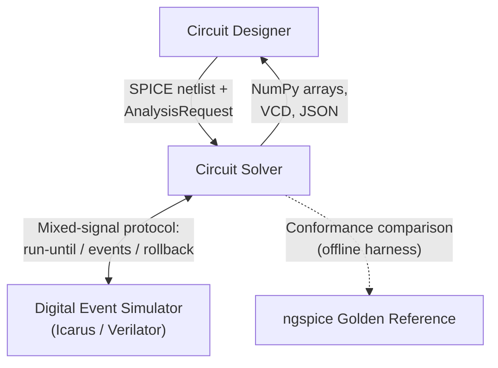
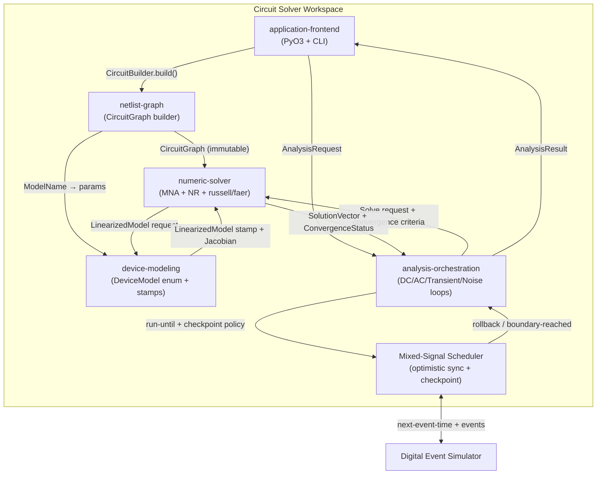
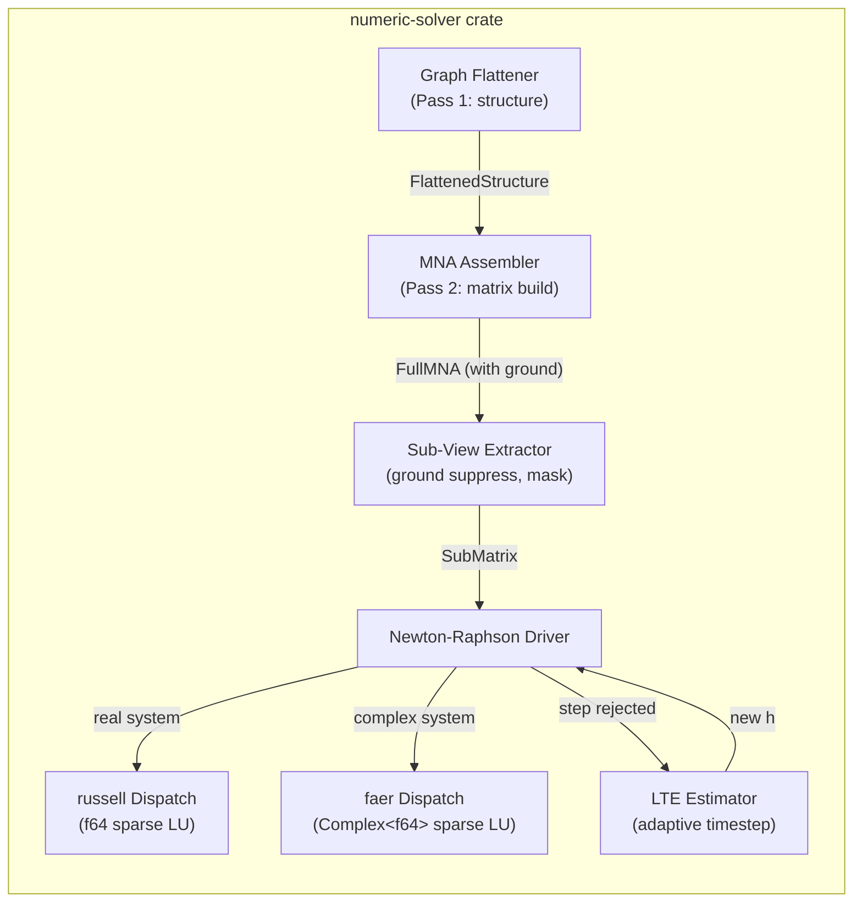
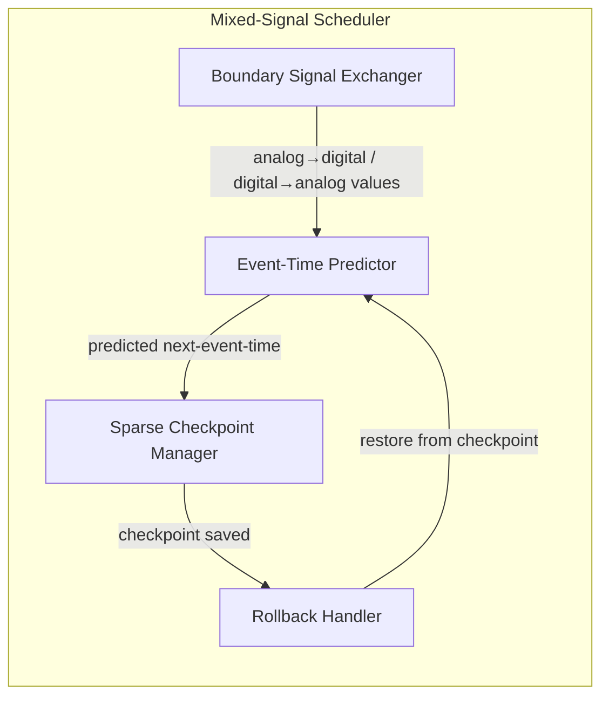

# Design

## Overview

The circuit-solver v1 design decomposes into five Rust crates organized as a Cargo workspace, plus one PyO3 extension crate. The workspace mirrors the bounded contexts from the manifest: `netlist-graph`, `device-modeling`, `numeric-solver`, `analysis-orchestration`, and `application-frontend`. Each crate exposes a narrow public API aligned to its context's ownership boundary, and internal implementation details remain crate-private.

The dataflow is strictly unidirectional from input to output: the Python frontend receives user input and delegates to the analysis orchestrator, which drives control loops (DC, AC, transient, noise, mixed-signal). Each control loop calls into the numeric solver for per-iteration MNA assembly and sparse-direct solve, which in turn calls the device model engine for stamp evaluation on the hot path. The netlist graph builder produces the immutable `CircuitGraph` once and is never re-entered during solve. The mixed-signal scheduler mediates between the analysis orchestrator and an external digital simulator, issuing run-until commands and performing rollback on misprediction.

The design honors all five in-force ADRs: PyO3 in-process binding with immutable graph handles (ADR-0001), hybrid russell/faer sparse-direct dispatch (ADR-0002), two-pass flattening with sub-views (ADR-0003), optimistic mixed-signal synchronization (ADR-0004), and closed-enum device model dispatch (ADR-0005). Each ADR is treated explicitly below.

## Context Diagram (C4 L1)

## Container / Component Diagram (C4 L2/L3)

### Component Detail: numeric-solver internals

### Component Detail: mixed-signal scheduler internals

## In-Force ADR Treatment

- **ADR-0001 — PyO3 In-Process Binding with Immutable Circuit Graph** — _Honored_
  The design places all PyO3 binding in the `application-frontend` crate. The `CircuitBuilder` Python class delegates to Rust, and `build()` returns an opaque `CircuitGraph` handle that is immutable from Python. `AnalysisRequest` objects are value types passed per-request. Result arrays use PyO3's `numpy` feature for zero-copy views into Rust-owned memory. The GIL is released around every solver entry point via `Python::allow_threads`. No shared mutable state crosses the language boundary.

- **ADR-0002 — Hybrid Sparse Direct Solver Backend (russell + faer)** — _Honored_
  The `numeric-solver` crate defines a `LinearSolver` trait with `solve_real` and `solve_complex` methods. Dispatch is by matrix element type: `russell_sparse` handles `f64` matrices (DC, transient), `faer` handles `Complex<f64>` matrices (AC, noise). The trait abstracts both backends so the analysis orchestrator never names a concrete solver. Both backends are pure Rust; no FFI to C/C++ BLAS/LAPACK is required in the default feature configuration.

- **ADR-0003 — Two-Pass Graph Flattening with Per-Analysis Sub-Views** — _Honored_
  Pass 1 (structure flattening) runs once per `CircuitGraph`, producing a `FlattenedStructure` with full incidence mapping including the ground node. Pass 2 (matrix assembly) builds the full MNA matrix from the flattened structure at each solve point; the sub-view extractor then applies analysis-specific masks (ground suppression for DC, complex augmentation for AC, companion-model stamps for transient, noise transfer-function assembly for noise). Switching analysis type reuses the `FlattenedStructure` and only re-stamps and re-masks.

- **ADR-0004 — Optimistic Mixed-Signal Synchronization via Shared Scheduler** — _Honored_
  The `MixedSignalScheduler` component is the sole mediator between the analog analysis orchestrator and the external digital simulator. The scheduler issues run-until commands to the analog side, queries next-event-time from the digital side, and performs rollback via the `CheckpointManager` on misprediction. Neither kernel queries the other directly. Rollback diagnostics are logged per the spec-stage tradeoff decision.

- **ADR-0005 — Closed Enum Device Model Dispatch** — _Honored_
  `DeviceModel` is a Rust enum with variants `Diode(DiodeParams)`, `BJT(BJTParams)`, and `MOSFET(MOSFETParams)` (where `MOSFETParams` is itself an enum over level-1 through BSIM4). Stamp evaluation and Jacobian computation dispatch through `match` on the enum, producing zero-cost monomorphized code. No `dyn DeviceModel` trait objects or runtime registries exist. Adding a new variant is a compile-time breaking change, accepted per ADR-0005.

## Architecturally Significant Requirements

The design must satisfy the following ASRs and QASs from the design manifest (slice 6):

| ID | Design commitment |
|---|---|
| ASR-1 | `CircuitGraph` is `Send + Sync` and wrapped in `Py<CircuitGraph>`; Python holds an opaque reference. No `&mut` crosses the boundary. |
| ASR-2 | Only `russell` and `faer` appear in `[dependencies]`; no `unsafe` FFI blocks for linear algebra. |
| ASR-3 | `FlattenedStructure` is computed once and cached on the `CircuitGraph`; subsequent analysis requests extract sub-views without re-flattening. |
| ASR-4 | `MixedSignalScheduler` owns both kernel handles; the analysis orchestrator and digital adapter communicate only through the scheduler's command interface. |
| ASR-5 | `DeviceModel` is a plain enum; stamp loops iterate `Vec<DeviceModel>` with `match`. No `Box<dyn>` or string-keyed lookup. |
| QAS-1 | Every analysis entry point in `application-frontend` wraps the solver call in `py.allow_threads()`. An integration test spawns a second Python thread that increments a counter while a transient analysis runs. |
| QAS-2 | Conformance harness compares results against ngspice golden files using per-node tolerance: `max(rel_pct * |v_ref|, abs_threshold)`. Tolerance parameters are configurable per analysis type. |
| QAS-3 | Mixed-signal conformance checks analog waveforms per QAS-2 tolerance and digital traces via event-trace equivalence at cycle boundaries. |
| QAS-4 | AC and noise analysis entry points check for a cached `OperatingPoint`; if absent, they internally dispatch a DC analysis first. If DC fails, they return early with Convergence "failed" and no frequency-domain data. |
| QAS-5 | The transient LTE estimator computes local truncation error per step; if LTE exceeds tolerance, the step is rejected, h is reduced, and the solve is retried. Only accepted time points appear in the output `Waveform`. |

## Known Pitfalls Avoided

| Pitfall | Mitigation in this design |
|---|---|
| NR false convergence (stall) | Dual convergence criterion in `NewtonRaphsonDriver`: both update norm and residue norm must fall below tolerance. |
| Floating nodes unreachable by NR | `netlist-graph` Pass 1 topology checker flags nodes with no DC path to ground; `numeric-solver` Gmin-stepping homotopy adds shunts. |
| Trapezoidal ringing | Three integration methods offered (BE, TR, Gear-2); default TR with documented ringing risk; LTE auto-shrink damps artifact. |
| BE / Gear-2 numerical damping | Charge-conserving companion models; user-selectable method; documentation of energy-accuracy tradeoff. |
| AC on non-LTI circuits | Element-type scan in analysis orchestrator; `AnalysisTypeError` raised if switching elements detected. |
| 1/f noise parameter sensitivity | Per-device noise breakdown (optional) in Result; warning when KF/AF deviate from foundry defaults. |
| Analog-digital boundary artifacts | Zero-order hold by default at boundary; linear interpolation optional; sub-view masking preserves charge conservation. |
| False conformance failures from tight envelope | `max(relative, absolute)` per-node tolerance; conformance report lists worst-case nodes and margins. |
| GIL held during Rust work | `Python::allow_threads` around every native solver call; integration test verifies concurrent thread progress. |
| Device model derivative discontinuities | Smooth limiting in model equations; closed-enum match enforces exhaustive derivative coverage; no unreachable fallback arm. |

## Open Questions

- **Tolerance envelope formalization.** The spec-stage suggestion recommends resolving the exact formulation. This design adopts `max(rel_pct × |v_ref|, abs_threshold)` per node per analysis type as the conformance criterion. Remaining ambiguity: should the absolute threshold apply to all nodes uniformly, or should ground-suppressed nodes use a different threshold? Awaiting user confirmation.
- **Analog-digital boundary interpolation.** This design defaults to zero-order hold. Linear interpolation is offered as a per-request option. The exact interpolation scheme when the analog timestep does not land on a digital event time is zero-order hold (hold the last analog value until the event time). This matches SPICE convention but may introduce stairstep artifacts for fast edges; the user can opt into linear interpolation.
- **Digital simulator contract violation.** Per spec/mixed-signal-cosim scenario "Digital simulator violates next-event-time contract": the scheduler rolls back to the last committed checkpoint before the early event time, logs a diagnostic warning, and continues. This design does not abort the simulation on contract violation; the user must inspect diagnostics to detect chronic violations.
- **Sparse checkpoint memory scaling.** The design uses sparse checkpoints (node voltages + reactive companion state) rather than dense snapshots. At very large circuit scale with high digital event rates, checkpoint memory may become prohibitive. This design does not include a lockstep fallback; that is deferred to a future change if profiling shows it is needed.
- **PyO3 distribution packaging.** The proposal deferred whether to distribute as maturin/pip wheel, conda, or both. This design does not prescribe a distribution format; the `application-frontend` crate supports `maturin develop` for development and `maturin build --release` for wheel production. Conda packaging is out of scope for this design.

## Decisions Distilled to ADRs

The following design decisions will be captured as ADRs by `scientia-intent-adr`:

- **Dual convergence criterion for Newton-Raphson** — require both update-norm and residue-norm below tolerance, not update-only. Proposed ADR slug: `0006-dual-convergence-criterion-newton-raphson`.
- **Zero-order hold default at analog-digital boundary** with linear interpolation opt-in. Proposed ADR slug: `0007-zero-order-hold-analog-digital-boundary`.
- **Per-node max(relative, absolute) tolerance envelope** for golden-reference conformance. Proposed ADR slug: `0008-per-node-max-relative-absolute-tolerance-envelope`.
- **Topology checker in netlist-graph Pass 1** that flags floating nodes and disconnected subgraphs before solve. Proposed ADR slug: `0009-topology-checker-floating-node-detection`.
