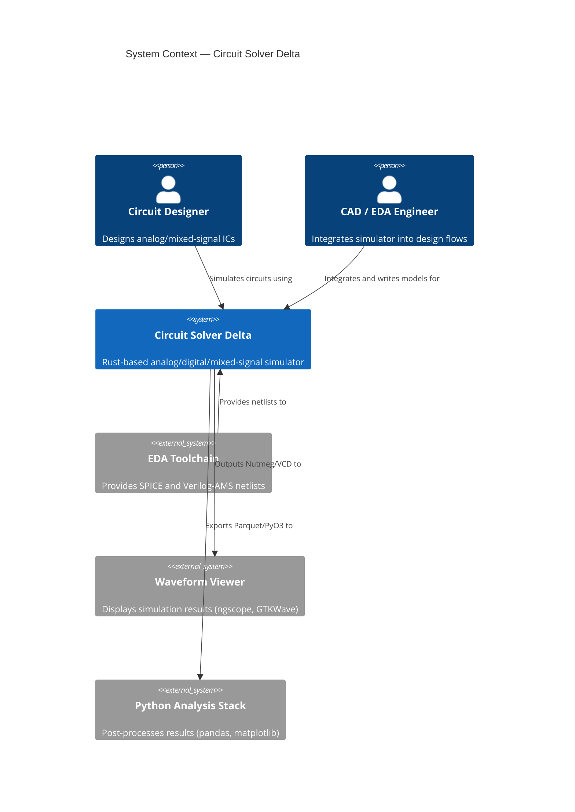
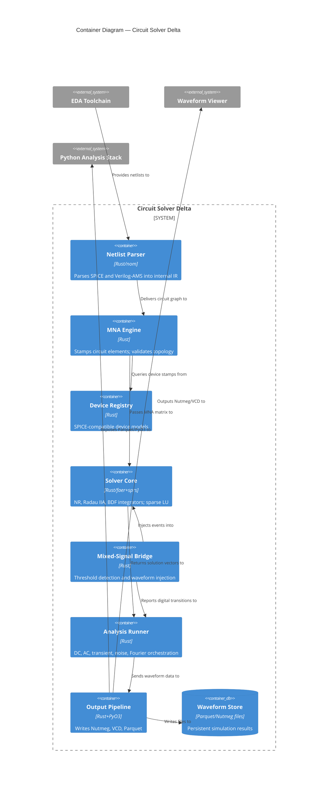
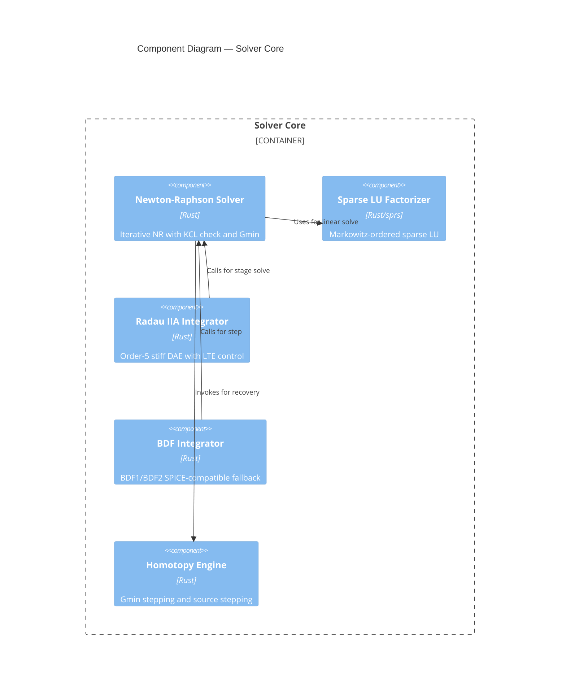

# Circuit Solver Delta — Architecture

## Overview
Circuit Solver Delta is a Rust-based analog/digital/mixed-signal circuit simulator designed for high-performance circuit simulation and analysis. The architecture follows the C4 model with clear separation of concerns across parsing, matrix stamping, device modeling, solving, mixed-signal bridging, and output generation.

---

## Level 1: System Context

---

## Level 2: Container Diagram

---

## Level 3: Component Diagram (Solver Core)

---

## Architecture Decision Records (ADRs)

The following ADRs govern key architectural and technology choices:

| Element | ADR | Decision |
|---------|-----|----------|
| **solverCore, mnaEngine, deviceRegistry, netlParser** | [ADR-0001](decisions/0001-rust-implementation-language.md) | Implement in Rust for memory safety and performance |
| **radauIntegrator** (primary), **bdfIntegrator** (fallback) | [ADR-0002](decisions/0002-radau-iia-primary-integrator.md) | Use Radau IIA as primary integrator with BDF fallback for stiff systems |
| **mnaEngine** | [ADR-0003](decisions/0003-mna-as-canonical-formulation.md) | Employ Modified Nodal Analysis (MNA) for circuit formulation |
| **mixedSignalBridge** | [ADR-0004](decisions/0004-threshold-crossing-mixed-signal-bridge.md) | Implement discrete mixed-signal coupling via threshold detection and waveform injection |
| **sparseLU** | [ADR-0005](decisions/0005-sparse-direct-lu-solver.md) | Use Markowitz-ordered sparse LU factorization for inner-loop performance |

---

## Data Flow

1. **Input**: EDA Toolchain provides SPICE netlist or Verilog-AMS source
2. **Parse**: Netlist Parser (netlParser) produces circuit graph
3. **Stamp**: MNA Engine stamps elements into sparse MNA matrix, queries Device Registry for model data
4. **Solve**: Analysis Runner coordinates solver selection; Solver Core executes NR iterations with sparse LU; Mixed-Signal Bridge injects digital events when needed
5. **Integrate**: Radau IIA or BDF integrators advance time; Homotopy Engine recovers from convergence failures
6. **Output**: Output Pipeline writes Nutmeg, VCD, and Parquet files to Waveform Store
7. **View**: Waveform Viewer reads Nutmeg/VCD; Python Analysis Stack processes Parquet

---

## Key Technologies

- **Rust**: Type safety, memory safety, zero-cost abstractions; primary implementation language
- **nom**: Nom-based SPICE/Verilog-AMS parser
- **faer**: Dense linear algebra for stiff systems
- **sprs**: Sparse matrix operations and Markowitz-ordered LU
- **PyO3**: Python bindings for Parquet and result objects
- **Nutmeg / VCD / Parquet**: Standard output formats for waveform data

---

## Quality Attributes

- **Performance**: Sparse LU kernel is inner-loop critical path; Rust + specialized crates ensure minimal overhead
- **Correctness**: MNA formulation and Radau IIA/BDF integrators are validated against SPICE standards
- **Reliability**: Gmin stepping and source stepping recover convergence failures; floating-node and V-source-loop detection prevent ill-formed circuits
- **Interoperability**: Nutmeg/VCD/Parquet outputs integrate with standard waveform tools; PyO3 bindings enable Python analysis workflows
