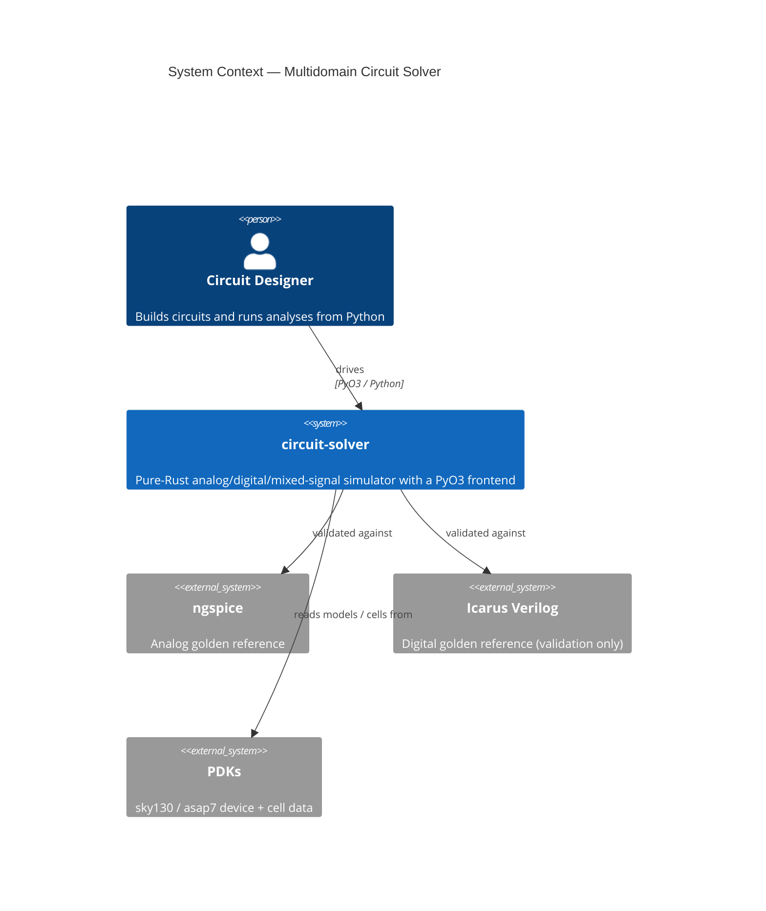
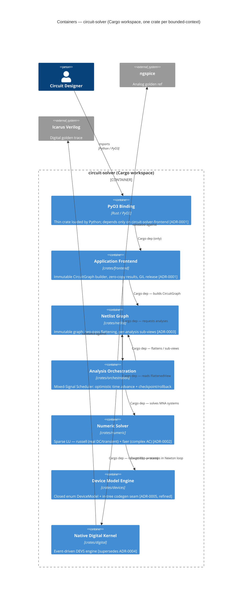
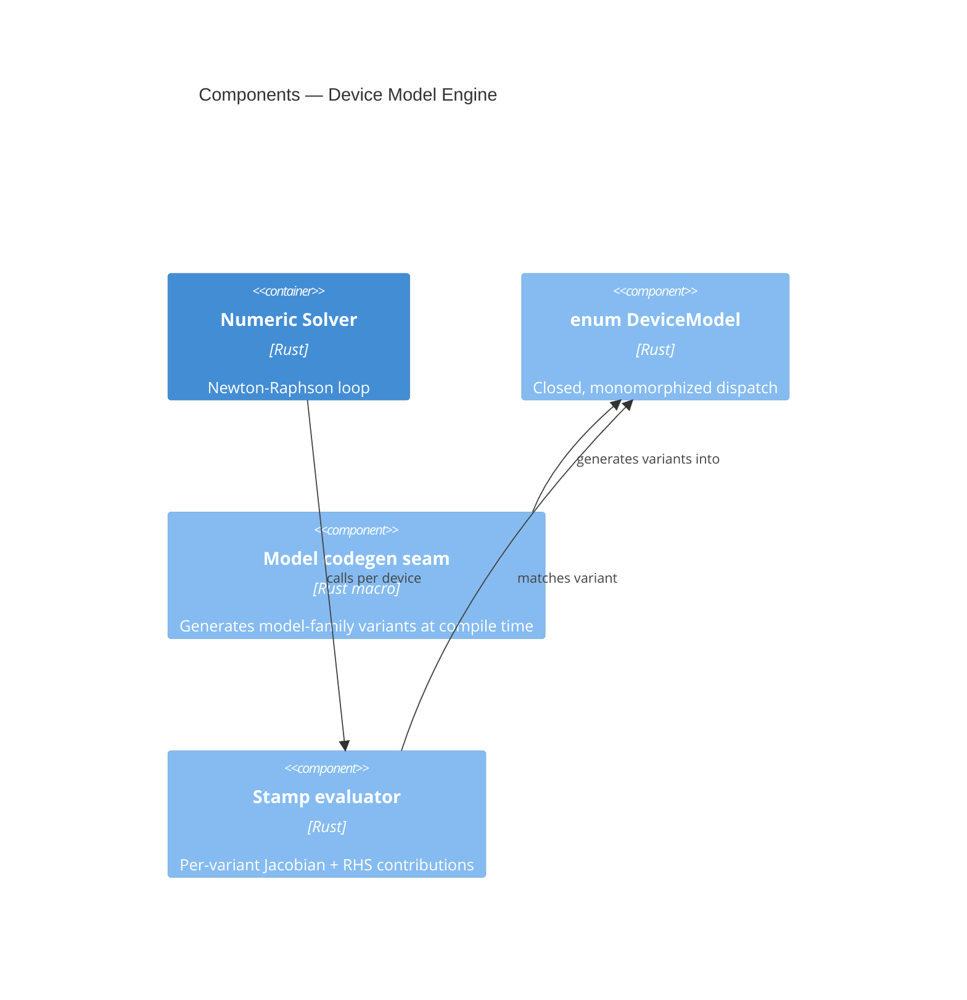

# Design: Multidomain Circuit Solver Architecture

## Overview

This design extends the accepted v1 architecture to industrial-strength coverage across
**analog** (continuous-time), **digital** (event-driven), and **mixed-signal** domains,
for both the device-modeling and simulation-engine layers. The implementation is a
**Cargo workspace of six domain crates** (one per bounded-context container) plus a thin
PyO3 binding crate that depends only on the frontend crate. All six domain crates live
under `crates/<name>/`; inter-crate dependencies are explicit Cargo path-deps, not
module re-exports across undeclared boundaries.

Decisions carried in unchanged (high inherited confidence): in-process PyO3 with an
immutable `CircuitGraph` ([[decisions/0001-pyo3-in-process-binding-with-immutable-circuit-graph]],
effective 1.045); pure-Rust hybrid sparse-direct solver — russell (real) + faer (complex)
([[decisions/0002-hybrid-sparse-direct-solver-backend-russell-faer]], 1.045); two-pass
graph flattening with per-analysis sub-views
([[decisions/0003-two-pass-graph-flattening-with-per-analysis-sub-views]], 1.045).

Decisions changed by this design (operator-confirmed at the design halt; see
`question-for-operator.md`):

- **Native digital engine replaces external co-simulation** — a new *Native Digital
  Kernel* container built on [[concepts/discrete-event-system-specification]] (effective
  0.95) and [[concepts/event-driven-architecture]] (effective 0.95). This **supersedes**
  [[decisions/0004-optimistic-mixed-signal-synchronization-via-shared-scheduler]] (1.045);
  the record-adr stage must emit the superseding ADR. Icarus Verilog is retained as the
  digital **golden reference** only.
- **In-tree codegen seam for device-model families** — refines (does not reverse)
  [[decisions/0005-closed-enum-device-model-dispatch]] (1.045): models remain a closed,
  compile-time-monomorphized `enum DeviceModel`; a macro/codegen seam scales the library
  without runtime registration.

Out of scope (confirmed): steady-state / RF engines (harmonic balance, shooting;
[[concepts/shooting-method]] effective 0.85).

## System Context (C4 L1)

## Container Diagram (C4 L2)

## Components & Approach

Six containers, each mapping to a bounded-context entity and the capability specs:

- **Application Frontend** ([[contexts/application-frontend]]) — PyO3 binding; immutable
  `CircuitGraph` builder, zero-copy NumPy result views, GIL release on long solves.
  Spec: `frontend-contract`. Honors ADR-0001.
- **Netlist Graph** ([[contexts/netlist-graph]]) — owns the immutable graph and the
  two-pass flatten producing per-analysis sub-views. Honors ADR-0003.
- **Analysis Orchestration** ([[contexts/analysis-orchestration]]) — the Mixed-Signal
  Scheduler: drives DC/AC/transient/noise analyses and the optimistic analog↔digital
  time advance with checkpoint/rollback. Specs: `analog-engine`, `mixed-signal-cosim`.
- **Numeric Solver** ([[contexts/numeric-solver]]) — [[concepts/modified-nodal-analysis]]
  (0.95) assembly + [[concepts/newton-raphson-method]] (0.95) with
  [[concepts/gmin-stepping]]/[[concepts/source-stepping]] (0.95) continuation;
  [[concepts/backward-euler]] (0.988)/[[concepts/trapezoidal-rule]] integration; sparse LU
  via russell/faer. Spec: `analog-engine`. Honors ADR-0002.
- **Device Model Engine** ([[contexts/device-modeling]]) — closed `enum DeviceModel` with
  static dispatch; the new **codegen seam** generates model-family variants at compile
  time. Spec: `device-modeling`. ADR-0005, refined.
- **Native Digital Kernel** — in-process event-driven engine (delta-cycle settling,
  ordered event queue). Specs: `digital-engine`, `digital-equivalence`. Supersedes ADR-0004.

### Device Model Engine internals (C4 L3 — the codegen seam is a new internal)

## Cargo Workspace

Seven crates in the workspace (`Cargo.toml` at the repo root declares all members).
Dependency edges are the only legal cross-crate access paths; the spec scenario
"inter-crate access requires an explicit Cargo dependency" enforces this.

| Crate | Path | Direct Cargo deps |
|-------|------|-------------------|
| `circuit-solver` (PyO3 binding) | _(workspace root)_ | `circuit-solver-frontend` |
| `circuit-solver-frontend` | `crates/frontend/` | `circuit-solver-netlist`, `circuit-solver-orchestration` |
| `circuit-solver-orchestration` | `crates/orchestration/` | `circuit-solver-netlist`, `circuit-solver-numeric`, `circuit-solver-digital` |
| `circuit-solver-numeric` | `crates/numeric/` | `circuit-solver-devices`, `circuit-solver-netlist` |
| `circuit-solver-netlist` | `crates/netlist/` | _(none)_ |
| `circuit-solver-devices` | `crates/devices/` | _(none)_ |
| `circuit-solver-digital` | `crates/digital/` | _(none)_ |

The three leaf crates (`netlist`, `devices`, `digital`) have no domain deps and
compile independently. `netlist` is the only type-exporter shared by multiple
upstream crates (`FlattenedView` consumed by both `orchestration` and `numeric`).

## Component Map

C4 component → the path globs it owns (under the Cargo workspace root; each
domain crate lives at `crates/<name>/`). Boundaries are the six domain crates
of the L2 diagram, each aligned to its bounded context. The execution layer
(`scientia-hermes-emit`) reads these to compute file-collision waves; a task
whose `touches` stray outside its component's globs is a decomposition smell.

- frontend: crates/frontend/src/**, crates/frontend/tests/**
- netlist: crates/netlist/src/**, crates/netlist/tests/**
- orch: crates/orchestration/src/**, crates/orchestration/tests/**
- numeric: crates/numeric/src/**, crates/numeric/tests/**
- devices: crates/devices/src/**, crates/devices/tests/**
- digital: crates/digital/src/**, crates/digital/tests/**

## Shared Contracts

The cross-component interfaces, each pinned to an owner and the ADR that ratifies
it. These are exactly the inter-container relationships in the L2 diagram; the
execution layer orders each contract's producer task before its consumers.

- netlist.CircuitGraph — owner: netlist — ratified-by: ADR-0001 (built by frontend, consumed by orch; immutable graph)
- netlist.FlattenedView — owner: netlist — ratified-by: ADR-0003 (two-pass flatten / per-analysis sub-views, consumed by numeric + orch)
- numeric.StampInterface — owner: numeric — ratified-by: ADR-0002 (MNA branch-stamping the device variants target)
- devices.DeviceModel — owner: devices — ratified-by: ADR-0005 (closed enum stamp evaluator dispatched in the Newton loop)
- digital.DigitalKernel — owner: digital — ratified-by: ADR-0006 (in-process run-until event queue the scheduler drives)

## Trade-offs

- **Multi-crate workspace vs. single flat crate.** Chosen: one crate per
  bounded-context container. Benefit: independent compilation units, enforced
  dependency boundaries (the compiler rejects undeclared cross-crate access),
  and finer-grained incremental rebuilds. Accepted cost: more `Cargo.toml`
  manifests to maintain and explicit re-exports at each crate boundary.
- **Native digital kernel vs. external co-simulation.** Chosen: native (single process, no
  IPC, tighter mixed-signal rollback). Accepted cost: building and maintaining an
  event-driven kernel, and **superseding an accepted ADR (0004)** — a durable reversal.
  Icarus is kept as golden reference, so correctness is still externally anchored.
- **Codegen seam vs. hand-written enum variants.** Chosen: compile-time macro seam.
  Accepted cost: macro/build complexity, in exchange for scaling the model library while
  keeping zero-cost dispatch and rejecting runtime registration (ADR-0005 invariant intact).
- **Pure-Rust solver ceiling.** No C/C++ fallback (ADR-0002). Risk: russell/faer behavior
  at industrial matrix sizes/conditioning — to be answered with benchmarks, not FFI
  (grill `cc-adr0002-pure-rust`).
- **Optimistic sync overhead.** Checkpoint memory + re-solve on digital misprediction
  (ADR-0004 mechanism retained under the native kernel).
- **Steady-state deferral.** Keeps the spec surface bounded; RF/PSS users unserved for now.
- **Event-trace (not byte-VCD) equivalence** as the digital metric, defined operationally
  in `digital-equivalence` so acceptance does not rest on the 0.70 stub claims
  (grill `ha-event-trace-equivalence`, `ha-value-change-dump`).
