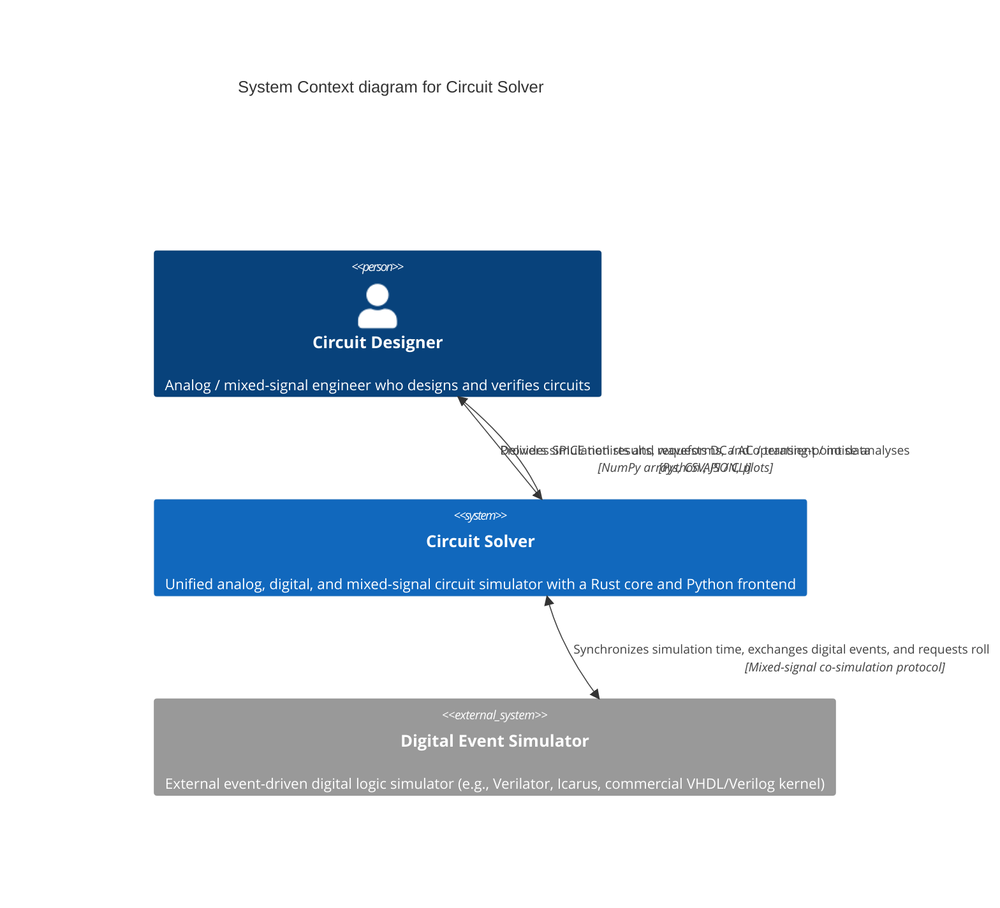
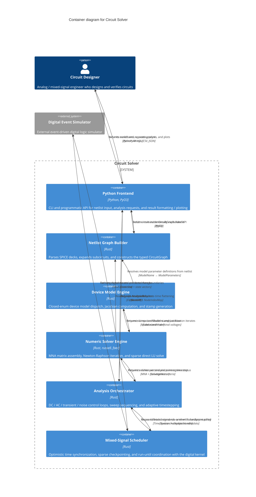

## Purpose

How does a SPICE netlist get parsed, flattened, stamped, and solved end-to-end, particularly in mixed-signal simulation environments?

## System Context

## Container Diagram

## Assumptions

- SPICE netlist files are text files that fit in memory after subcircuit expansion (< 100 MB typical).
- The external digital event simulator exposes a next-event-time API and accepts rollback-to-checkpoint commands.
- The `russell` and `faer` crates compile on the target platform without additional system dependencies beyond a standard BLAS/LAPACK when `russell` requests it.
- Python 3.9+ is available for the PyO3 extension module.
- The mixed-signal scheduler can predict digital event boundaries with sufficient accuracy to place sparse checkpoints; mispredictions trigger full re-solve from the last good checkpoint rather than incremental replay.
- The circuit graph is connected after ground reference insertion; disconnected floating nodes are either rejected or explicitly tied.

## Open Questions

- How are incremental netlist modifications (adding or removing elements mid-session) propagated from the Python Frontend to the Netlist Graph Builder without rebuilding the entire graph?
- What is the failure mode when the external digital simulator violates the optimistic time-advance contract (for example, emitting an event earlier than the previously reported next-event-time without a prior warning)?
- Should the ModelLibrary support runtime model-parameter overrides from Python, or are `.model` cards in the netlist the only source of truth for parameter values?
- How does the sparse checkpointing strategy scale when the analog circuit contains thousands of reactive elements and the digital event rate is high?

## Decisions Surfaced

**PyO3 In-Process Binding with Immutable Circuit Graph** — The Python Frontend container is a PyO3 extension module that constructs an immutable `CircuitGraph` via the Netlist Graph Builder's builder API; per-request mutable analysis state flows to the Analysis Orchestrator, preserving Rust ownership discipline while giving Python ergonomic incremental construction. → ADR-0001

**Hybrid Sparse Direct Solver Backend (russell + faer)** — The Numeric Solver Engine container carries two backend technologies: `russell` for real-valued DC and transient sparse LU, and `faer` for complex-valued AC small-signal LU. This split avoids FFI while matching each analysis type to the appropriate pure-Rust solver. → ADR-0002

**Two-Pass Graph Flattening with Per-Analysis Sub-Views** — The Numeric Solver Engine reads the graph structure once from the Netlist Graph Builder; the full matrix (including ground) is built during flattening, and the Analysis Orchestrator extracts the relevant sub-view or applies constraint masks at solve time, avoiding rebuilds when analysis needs differ. → ADR-0003

**Optimistic Mixed-Signal Synchronization via Shared Scheduler** — The Mixed-Signal Scheduler container mediates all time-sync and rollback traffic between the Analysis Orchestrator and the external Digital Event Simulator. Neither kernel queries the other directly; the scheduler owns both and issues "run-until" commands, keeping the context boundary clean. → ADR-0004

**Closed Enum Device Model Dispatch** — The Device Model Engine container uses a closed enum (`enum DeviceModel { Diode(...), BJT(...), MOSFET(...), ... }`) for zero-cost dispatch of core semiconductor models. The vision bounds device scope to diode, BJT, and MOSFET Level-1 through BSIM4-level; no runtime extensibility requirement is stated. → ADR-0005

## Cross-Links

- [[vision/circuit-solver]] — Scope, differentiation, and value proposition for the R&D effort.
- [[grills/circuit-solver]] — Resolved design questions that shaped the container boundaries and interaction patterns above.
- [[contexts/netlist-graph]] — Shared kernel with device-modeling around `Element` and `ModelName`.
- [[contexts/device-modeling]] — Customer-supplier to numeric-solver for `LinearizedModel` stamps.
- [[contexts/numeric-solver]] — Shared kernel with analysis-orchestration around `SolutionVector` and `ConvergenceStatus`.
- [[contexts/analysis-orchestration]] — Open-host-service interface to application-frontend via `AnalysisRequest` / `AnalysisResult`.
- [[contexts/application-frontend]] — Conformist consumer of the analysis-orchestration API.
- [[context-maps/circuit-solver]] — False-cognate inventory and integration-pattern assignments for all five contexts.
- [[specs/circuit-solver]] — Forward placeholder: Gherkin scenarios and acceptance criteria derived from this architecture.
- Forward placeholder: ADRs for each `## Decisions Surfaced` entry to be opened via `/wiki-adr <decision title>`.
