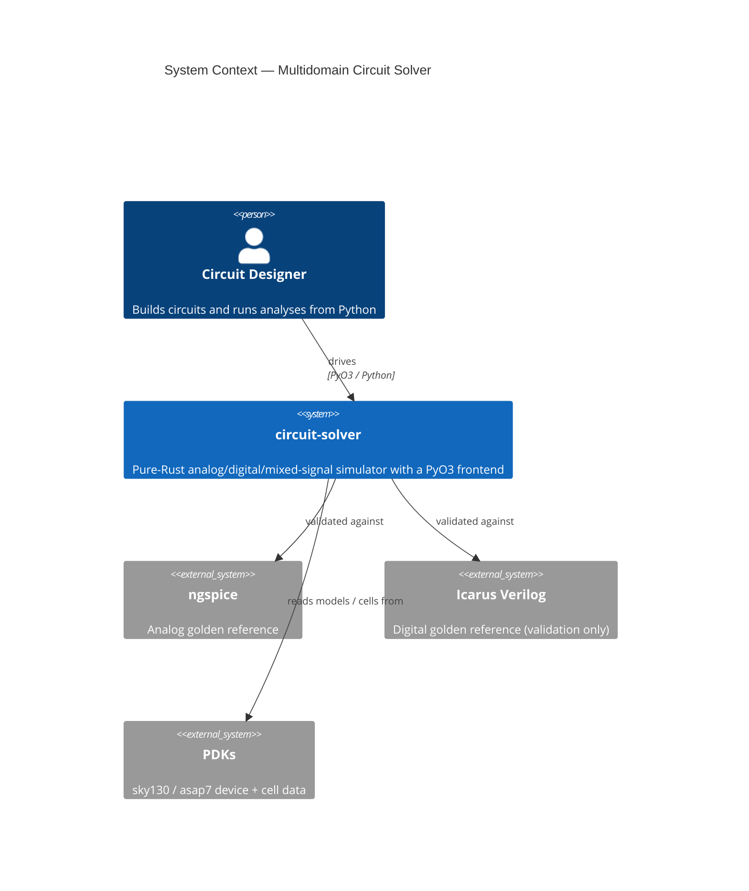
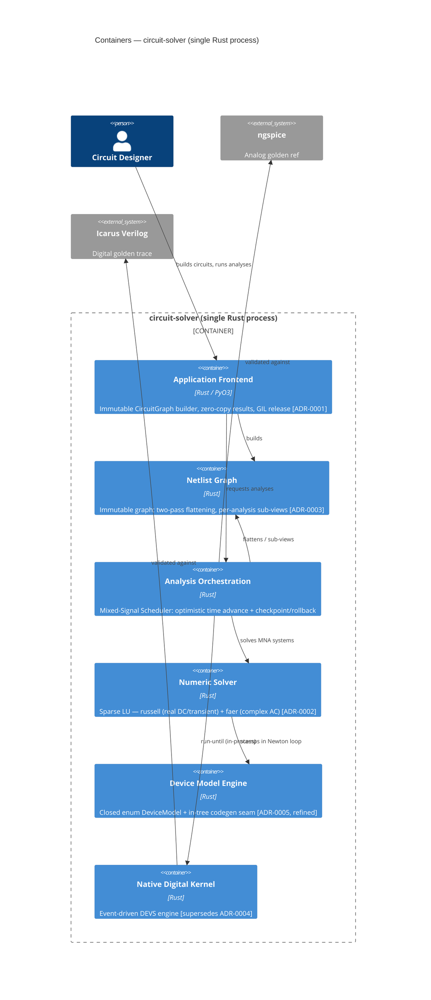
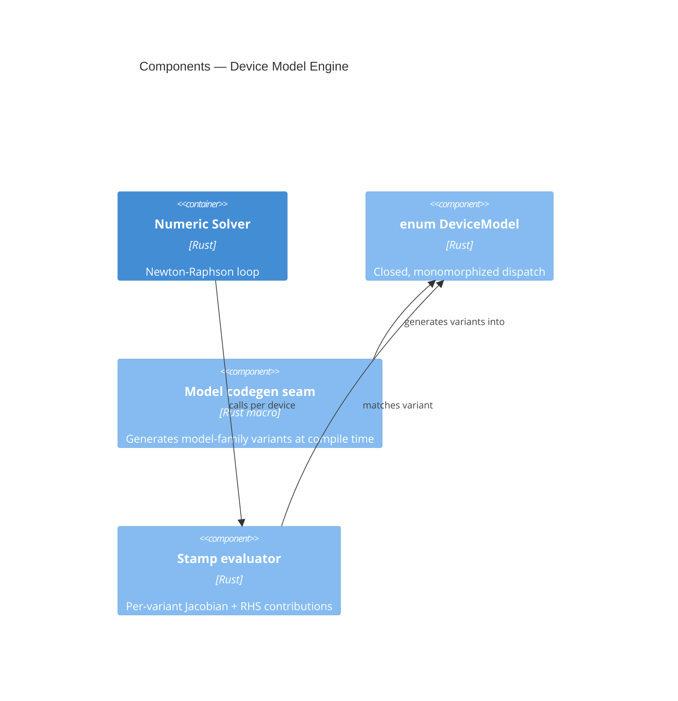

## Purpose

Pure-Rust analog/digital/mixed-signal circuit simulator with a PyO3 frontend — single Rust process, single-address-space for mixed-signal co-simulation performance. Supersedes the v1 analog-only architecture (ADR-0001–0003 retained).

## System Context

## Container Diagram

### Container responsibilities

| Container | Responsibility | Specs |
|---|---|---|
| Application Frontend | PyO3 binding; immutable `CircuitGraph` builder; zero-copy NumPy result views; GIL release on long solves | `frontend-contract` |
| Netlist Graph | Immutable graph; two-pass flattening producing per-analysis sub-views | `netlist-graph` |
| Numeric Solver | MNA assembly, Newton-Raphson with gmin/source-stepping continuation, backward-Euler/trapezoidal integration, sparse LU (russell real, faer complex) | `analog-engine` |
| Device Model Engine | Closed `enum DeviceModel`; in-tree codegen seam generating model-family variants at compile time; per-variant stamp evaluator | `device-modeling` |
| Native Digital Kernel | In-process event-driven DEVS engine; delta-cycle combinational settling; ordered event queue; checkpoint/restore for rollback | `digital-engine`, `digital-equivalence` |
| Analysis Orchestration | DC/AC/transient/noise drivers; Mixed-Signal Scheduler: optimistic analog↔digital time advance with checkpoint/rollback | `analog-engine`, `mixed-signal-cosim` |

## Components — Device Model Engine (L3)

## Component Map

Ownership and file boundaries for the execution layer (collision-wave calculation). Task `touches` must stay within the assigned globs.

| Component | Owner | Path globs |
|---|---|---|
| frontend | Application Frontend | project/src/frontend/**, project/tests/frontend/** |
| netlist | Netlist Graph | project/src/netlist/**, project/tests/netlist/** |
| numeric | Numeric Solver | project/src/numeric/**, project/tests/numeric/** |
| devices | Device Model Engine | project/src/devices/**, project/tests/devices/** |
| digital | Native Digital Kernel | project/src/digital/**, project/tests/digital/** |
| orch | Analysis Orchestration | project/src/orchestration/**, project/tests/orchestration/** |

## Shared Contracts

Cross-component interfaces. The execution layer orders the producer task before consumer tasks.

| Contract | Owner | Ratified-by |
|---|---|---|
| netlist.CircuitGraph | netlist | ADR-0001 |
| netlist.FlattenedView | netlist | ADR-0003 |
| numeric.StampInterface | numeric | ADR-0002 |
| devices.DeviceModel | devices | ADR-0005 |
| digital.DigitalKernel | digital | ADR-0006 |

## Assumptions

- SPICE netlist files are text files that fit in memory after subcircuit expansion (< 100 MB typical).
- The `russell` and `faer` crates compile on the target platform without additional system dependencies beyond a standard BLAS/LAPACK when `russell` requests it.
- Python 3.9+ is available for the PyO3 extension module.
- The mixed-signal scheduler predicts digital event boundaries with sufficient accuracy to place sparse checkpoints; mispredictions trigger full re-solve from the last good checkpoint.
- The circuit graph is connected after ground reference insertion; disconnected floating nodes are either rejected or explicitly tied.
- Zero-cost dispatch is preserved: the closed `enum DeviceModel` does not use dynamic dispatch or heap allocation at any call site.

## Open Questions

- How are incremental netlist modifications (adding or removing elements mid-session) propagated from the Python Frontend to the Netlist Graph Builder without rebuilding the entire graph?
- What is the failure mode when the native digital kernel emits an event earlier than the previously reported next-event-time without a prior warning?
- Should the ModelLibrary support runtime model-parameter overrides from Python, or are `.model` cards in the netlist the only source of truth for parameter values?
- How does the sparse checkpointing strategy scale when the analog circuit contains thousands of reactive elements and the digital event rate is high?
- Can the codegen seam be extended to cover model families for new process corners (e.g., fast/slow NMOS variants) without re-opening the closed enum?

## Decisions Surfaced

**PyO3 In-Process Binding with Immutable Circuit Graph** — The Application Frontend container is a PyO3 extension module that constructs an immutable `CircuitGraph` via the Netlist Graph Builder's builder API; per-request mutable analysis state flows to the Analysis Orchestrator, preserving Rust ownership discipline while giving Python ergonomic incremental construction. → ADR-0001

**Hybrid Sparse Direct Solver Backend (russell + faer)** — The Numeric Solver container carries two backend technologies: `russell` for real-valued DC and transient sparse LU, and `faer` for complex-valued AC small-signal LU. This split avoids FFI while matching each analysis type to the appropriate pure-Rust solver. → ADR-0002

**Two-Pass Graph Flattening with Per-Analysis Sub-Views** — The Numeric Solver reads the graph structure once from the Netlist Graph Builder; the full matrix (including ground) is built during flattening, and the Analysis Orchestrator extracts the relevant sub-view or applies constraint masks at solve time, avoiding rebuilds when analysis needs differ. → ADR-0003

**Native Event-Driven Digital Kernel** — The Native Digital Kernel container is built in-process as an event-driven DEVS engine (delta-cycle combinational settling, ordered event queue, checkpoint/restore). The Analysis Orchestration drives it via `run-until`. Icarus Verilog is retained as the digital **golden reference** only — not a runtime co-simulator. This supersedes ADR-0004. → ADR-0006

**Closed Enum Device Model Dispatch with In-Tree Codegen Seam** — The Device Model Engine container uses a closed `enum DeviceModel { Diode(...), BJT(...), MOSFET(...), ... }` for zero-cost monomorphized dispatch. A compile-time macro/codegen seam generates model-family variants into the closed enum at build time, scaling the library without runtime registration. Refines ADR-0005. → ADR-0007

## Cross-Links

- [[vision/circuit-solver]] — Scope, differentiation, and value proposition.
- [[grills/circuit-solver]] — Resolved design questions that shaped the container boundaries.
- [[proposals/2026-05-28-multidomain-solver-architecture]] — Full design doc, ADRs, capability specs, and task breakdown (25 items across 6 components).
- [[concepts/discrete-event-system-specification]] — Formal basis for the Native Digital Kernel.
- [[concepts/modified-nodal-analysis]] — MNA foundation for the Numeric Solver.
- [[concepts/newton-raphson-method]] — Nonlinear solve foundation with gmin/source-stepping continuation.
- [[specs/circuit-solver]] — Forward placeholder: Gherkin scenarios and acceptance criteria.
- [[decisions/0001-pyo3-in-process-binding-with-immutable-circuit-graph]] — ADR-0001.
- [[decisions/0002-hybrid-sparse-direct-solver-backend-russell-faer]] — ADR-0002.
- [[decisions/0003-two-pass-graph-flattening-with-per-analysis-sub-views]] — ADR-0003.
- [[decisions/0006-native-event-driven-digital-engine]] — ADR-0006 (supersedes ADR-0004).
- [[decisions/0007-in-tree-codegen-seam-for-closed-enum-device-models]] — ADR-0007.